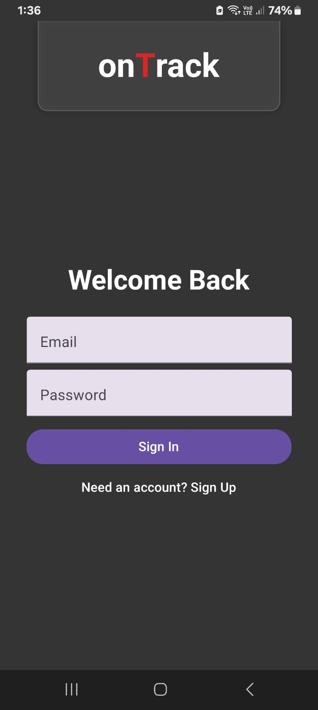
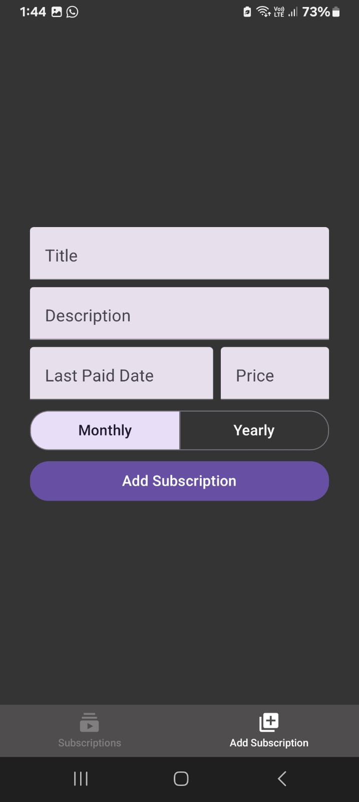
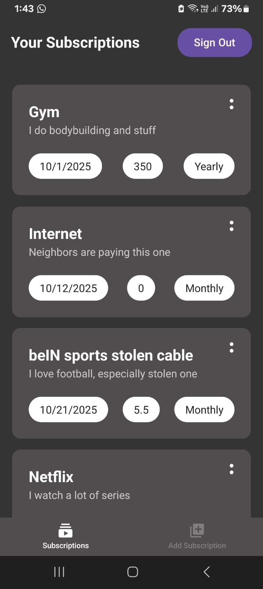

# onTrack

Your subscriptions tracker.

---

## Links

- App link for installing, using and testing: [APK](https://expo.dev/accounts/seifadinmadkour/projects/onTrack/builds/3640ebe2-050c-4287-abc8-44043f07f5d3)
- GitHub repo: [GitHub](https://github.com/Sam50x/onTrack)

---

## Workflow

- Just Sign In or Create an Account

---

- Add your subscriptions

---

- View your subscriptions sorted by the due date

---

- You can edit and delete all your subscriptions simply by clicking the two dots.

---

## Tech Stack

- Expo (React Native) for mobile app development.
- Supabase & PostgreSQL for authentication and database management with real-time changes.
- EAS build for building the app.

---
